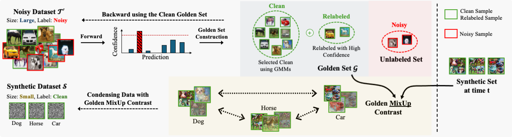
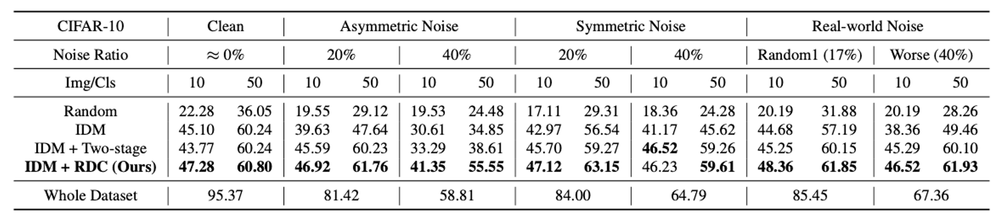
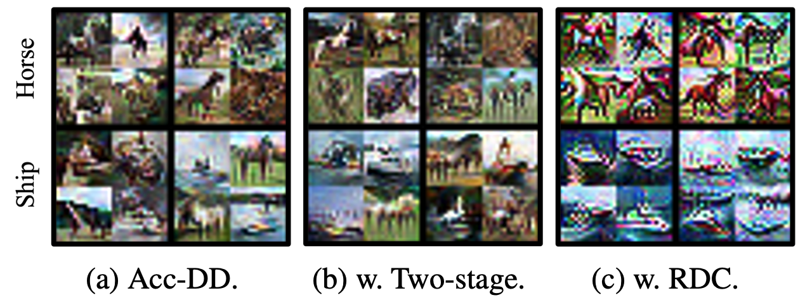

<div align="center">
<h1>Robust Dataset Condensation using Supervised Contrastive Learning</h1>

<strong>Authors:</strong> Nicole Hee-Yeon Kim and Hwanjun Song

<strong>Official repository for the paper: Robust Dataset Condensation using Supervised Contrastive Learning (ICCV 2025)</strong>

</div>

## 📑 Summary

Dataset condensation compresses large datasets into compact synthetic sets, but existing methods break down under noisy labels. We propose Robust Dataset Condensation (RDC), the first end-to-end method that directly generates noise-resilient synthetic data without extra cleaning steps. RDC integrates supervised contrastive learning with Golden MixUp Contrast, which sharpens class boundaries and enriches diversity using clean samples from noisy data. Experiments on CIFAR-10/100 show that RDC consistently outperforms prior methods across asymmetric, symmetric, and real-world noise.


## 📄 Paper
Our paper is now available on the [ICCV 2025 Open Access page](https://openaccess.thecvf.com/content/ICCV2025/papers/Kim_Robust_Dataset_Condensation_using_Supervised_Contrastive_Learning_ICCV_2025_paper.pdf).


## 🖼️ Overview

RDC enhances dataset condensation by integrating supervised contrastive learning and a novel Golden MixUp Contrast strategy, enabling robust synthetic data generation even under noisy labels.

## 📊 Results
We report classification accuracy (%) under noisy CIFAR-10:

Similar improvements are consistently observed on CIFAR-100 and Tiny-ImageNet.

## 🎨 Visualization
RDC improves the quality of condensed images under noisy labels.

- **(a) Acc-DD**: severe interference across classes.
- **(b) Two-stage (cleaning + condensation)**: reduces noise but still leaves contamination.  
- **(c) RDC (ours)**: clean, well-separated class features without interference.

## 🚀 Setup

Clone the repository and set up the environment:

```bash
# Clone the repository
git clone https://github.com/DISL-Lab/RDC-ICCV2025.git
cd RDC-ICCV2025

# Create a new conda environment with Python 3.9
conda create -n rdc python=3.10

# Activate the environment
conda activate rdc

# Install the required packages
pip install -r requirements.txt
```

## 💻 Usage
### 1. IDM

#### IDM Baseline (Reference)
Run dataset condensation with IDM on CIFAR-10 (IPC=50):
```bash
python3 IDM_cifar.py --dataset CIFAR10 --ipc 50 --ce_weight 0.1
```
Main Options:
```bash
--dataset: CIFAR10 / CIFAR10N_asym_40 / CIFAR10N_asym_20 / CIFAR10N_sym_40 / CIFAR10N_sym_20 / CIFAR10N_ran1 / CIFAR10N_worse / CIFAR100 / CIFAR100N_asym_20 / CIFAR100N_asym_40 / CIFAR100N_sym_20 / CIFAR100N_sym_40 / CIFAR100N_noisy
--ipc: 1 / 10 / 50 (images per class)
--model: ResNet18 (default)
--eval_interval: 1000 (for ipc=1,10) / 2000 (for ipc=50)
--ce_weight: 0.5 (ipc=1,10) / 0.1 (ipc=50)
```

#### RDC + IDM
Run dataset condensation with IDM+RDC on CIFAR-10 (IPC=50):
```bash
python3 IDM_cifar+RDC.py --dataset CIFAR10 --ipc 50 --ce_weight 0.1
```
Main Options:
```bash
--dataset: CIFAR10 / CIFAR10N_asym_40 / CIFAR10N_asym_20 / CIFAR10N_sym_40 / CIFAR10N_sym_20 / CIFAR10N_ran1 / CIFAR10N_worse / CIFAR100 / CIFAR100N_asym_20 / CIFAR100N_asym_40 / CIFAR100N_sym_20 / CIFAR100N_sym_40 / CIFAR100N_noisy
--ipc: 1 / 10 / 50 (images per class)
--model: ResNet18 (default)
--eval_interval: 1000 (for ipc=1,10) / 2000 (for ipc=50)
--ce_weight: 0.5 (ipc=1,10) / 0.1 (ipc=50)
```

### 2. Acc-DD

The Acc-DD workflow consists of two main steps:  
(1) Pretrain early-stage models on real data, and  
(2) Optimize condensed data using the pretrained models.  

Below is a simplified guideline (adapted from the [Acc-DD repository](https://github.com/VICO-UoE/DatasetCondensation)).

#### 1. Pretrain Early-Stage Models
```bash
python pretrain.py \
  -d <dataset> \
  --nclass 10 \
  -n resnet \
  --pt_from 2 \
  --aug_type color_crop_cutout_flip_scale_rotate
```

#### 2. Acc-DD Baseline: Condensation Step (Reference)
```bash
python condense.py \
  --reproduce \
  -d <dataset> \
  -f 2 \
  --ipc 10 \
  -n resnet \
  --model_path <PRETRAINED_DIR>
```

#### 3. Acc-DD + RDC: Condensation Step
```bash
python condense+RDC.py \
  --reproduce \
  -d <dataset> \
  -f 2 \
  --ipc 10 \
  -n resnet \
  --model_path <PRETRAINED_DIR>
```
```-d```: dataset (cifar10 / cifar10n_asym_40 / cifar10n_asym_20 / cifar10n_sym_40 / cifar10n_sym_20 / cifar10n_ran1 / cifar10n_worse)

## 📌 Citation
Please check back once the ICCV 2025 paper is officially available.  
BibTeX will be provided here.

## 🙏 Acknowledgments
Our code implementations are based on [IDM (Improved Distribution Matching for Dataset Condensation)](https://github.com/uitrbn/IDM) and [Acc-DD (Accelerating Dataset Distillation via Model Augmentation)](https://github.com/ncsu-dk-lab/Acc-DD).  
We thank the authors for releasing their code.
